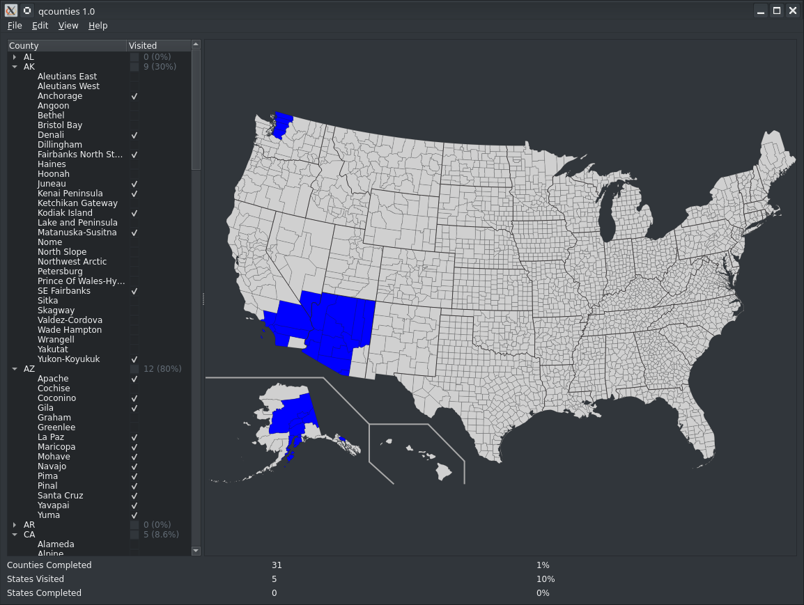

QCounties
=========
This is intended to be a helpful tool for tracking your progress in visiting
all the counties in the United States.

The map updates as you modify the checkboxes in the tree view, and you get
various statistics about your progress.  You can also export the map as an SVG
or PNG.

The file format is just a CSV with a pair of (county name, visited boolean), so
you can also make changes in your favorite text editor.

Dependencies
============
* Conan (and, thus, Python)
* CMake >= 3.25
* Ninja
* Perl (indirectly)

Compiling
=========
Theoretically, you ought to be able to just `perl build.pl && perl run.pl`.

Builds are sporadically run on:
* Debian bookworm
* Mac OS 15
* Arch
* Windows 10
